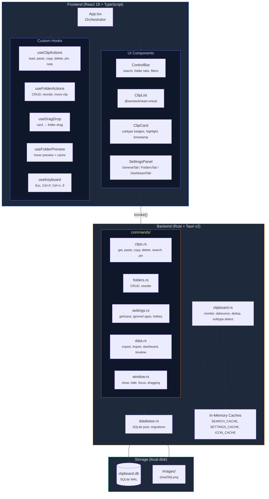
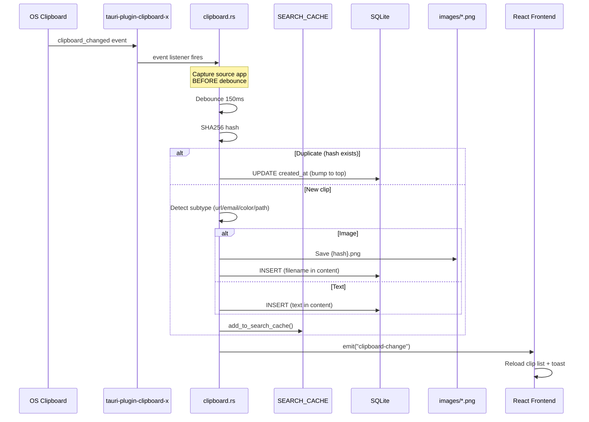
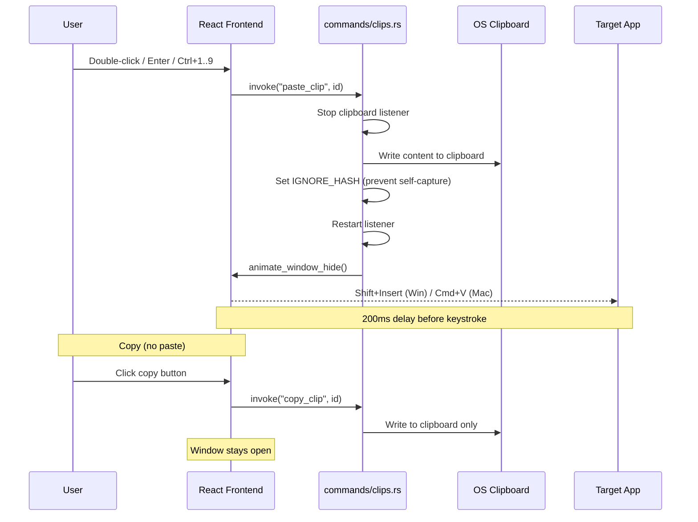

<h1 align="center">
    <picture>
            
        </picture>
        <br>
        ClipPaste
</h1>

<p align="center">
    <strong>A beautiful clipboard history manager for Windows, macOS &amp; Linux</strong>
</p>

<p align="center">
    <a href="https://github.com/Phieu-Tran/ClipPaste/releases/latest"></a>
    <a href="https://github.com/Phieu-Tran/ClipPaste/releases"></a>
    <a href="LICENSE"></a>
</p>

<p align="center">
    Built with <strong>Rust + Tauri v2 + React 18 + TypeScript</strong> — fast, private, and lightweight.
</p>

---

## Screenshots

<p align="center">
    
</p>

<p align="center">
    
</p>

---

## Features

### Clipboard

| | Feature | Description |
|:---:|:---|:---|
| 🔒 | **Private & Local** | All data stored locally — never leaves your machine |
| ⚡ | **Fast & Lightweight** | Rust backend, ~50MB RAM, instant search |
| 🔍 | **Smart Search** | Multi-word AND search with relevance ranking (exact match first) |
| 🏷️ | **Content Detection** | Auto-detect URLs, emails, color codes, file paths — styled cards |
| 📌 | **Per-Folder Pin** | Pin clips to the top within each folder |
| ✏️ | **Edit Before Paste** | Modify text content before pasting |
| 📋 | **Paste as Plain Text** | Strip formatting and paste clean text |
| 📝 | **Notes** | Add annotations to any clip |
| 🖼️ | **Image on Disk** | Images stored as files, not in DB — keeps database small |

### Organization

| | Feature | Description |
|:---:|:---|:---|
| 📁 | **Folders** | Color-coded folders with drag & drop |
| 👀 | **Hover Preview** | Preview folder contents without switching |
| 🗂️ | **Folder Protection** | Folder items survive bulk clear operations |
| 🔢 | **Paste Count** | Track how many times each clip is pasted |

### Dashboard & History

| | Feature | Description |
|:---:|:---|:---|
| 📊 | **Dashboard** | Stats overview — total clips, today, images, folders |
| 📅 | **History Timeline** | Browse clips by date with calendar picker |
| 📈 | **Activity Chart** | Clips per day (last 7 days), clickable bars |
| 🏆 | **Top Apps** | Most used source apps with visual bar chart |
| 💾 | **Export / Import** | Backup & restore as zip (DB + images) |

### Appearance & System

| | Feature | Description |
|:---:|:---|:---|
| 🎨 | **Themes & Effects** | Dark / Light / System + Mica, Mica Alt effects |
| 🖥️ | **Multi-Monitor** | Window appears on the active display |
| 🚫 | **Ignore Apps** | Exclude password managers, banking apps, etc. |
| ⌨️ | **Custom Hotkey** | Default: `Ctrl+Shift+V` |
| 🔄 | **Auto-Update** | In-app update with progress bar |
| 📂 | **Custom Data Dir** | Choose where to store your data |

---

## Installation

### Download

> **[Download the latest release](https://github.com/Phieu-Tran/ClipPaste/releases/latest)**

| Platform | Architecture | Format |
|:---------|:-------------|:-------|
| **Windows** | x64, ARM64 | `.exe` (NSIS), `.msi` |
| **macOS** | Apple Silicon (M1+), Intel | `.dmg` |
| **Linux** | x64 | `.deb`, `.AppImage`, `.rpm` |

### Platform Support

| Feature | Windows | macOS | Linux |
|:--------|:-------:|:-----:|:-----:|
| Clipboard monitoring | ✅ | ✅ | ✅ |
| Auto-paste | ✅ (Shift+Insert) | ✅ (Cmd+V) | ❌ |
| Source app detection | ✅ | ✅ | ❌ |
| Source app icon | ✅ | ❌ | ❌ |
| Window effects | Mica / Mica Alt | Vibrancy | ❌ |
| Drag-copy to apps | ✅ | ✅ | ✅ |

---

## Keyboard Shortcuts

| Shortcut | Action |
|:---------|:-------|
| `Ctrl+Shift+V` | Toggle window *(customizable)* |
| `Ctrl+1` .. `Ctrl+9` | Quick-paste clip 1–9 |
| `Ctrl+F` | Focus search bar |
| `Escape` | Close window / Clear search |
| `Enter` | Paste selected clip |
| `Ctrl+Delete` | Delete selected clip |
| `P` | Pin / Unpin selected clip |
| `E` | Edit before paste *(text only)* |
| `↑` `↓` | Navigate between clips |

---

## Architecture

### System Overview



### Clipboard Data Flow



### Paste Flow



### Storage Layout

```
{data_dir}/ClipPaste/
├── clipboard.db           # SQLite (WAL mode)
├── clipboard.db-wal       # Write-Ahead Log (concurrent reads + writes)
├── clipboard.db-shm       # Shared memory index for WAL
└── images/                # Clipboard images (not in DB)
    ├── {sha256}.png       # Deduplicated by content hash
    └── ...
```

### Key Design Decisions

| Decision | Reason |
|:---------|:-------|
| **SQLite WAL mode + tuned PRAGMAs** | Concurrent reads/writes, 8MB cache, 64MB mmap, 5s busy_timeout |
| **Images on disk** | DB stays small (~2MB), images in separate files |
| **In-memory search cache** | Instant multi-word search (<1ms for 1000+ clips) |
| **Relevance sorting** | Exact substring matches rank above partial word matches |
| **Shift+Insert** for paste | Works in terminals (PowerShell, WSL) where Ctrl+V doesn't |
| **@tanstack/react-virtual** | Horizontal virtual list — constant DOM count regardless of clip count |
| **Hard delete** (no soft delete) | No DB bloat, no stale rows, simpler queries |
| **Pinned + folder items protected** | Bulk clear, dedup, and auto-trim never touch pinned or folder clips |
| **Atomic DB operations** | Transactions for folder delete, max_items trim — crash-safe |
| **Async image I/O** | `tokio::fs::read` prevents blocking the Tokio runtime |
| **Modular commands/** | 7 domain files instead of monolithic commands.rs (1500+ lines) |

---

## Tech Stack

| Layer | Technology |
|:------|:-----------|
| Framework | [Tauri v2](https://tauri.app/) |
| Frontend | React 18 + TypeScript + Vite |
| Styling | TailwindCSS v3 + tailwind-merge |
| Virtual List | [@tanstack/react-virtual](https://tanstack.com/virtual) |
| Backend | Rust (Tokio async runtime) |
| Database | SQLite via [sqlx](https://github.com/launchbadge/sqlx) |
| Window Effects | [window-vibrancy](https://github.com/Phieu-Tran/window-vibrancy) *(custom fork)* |

---

## Building from Source

### Prerequisites

- [Node.js](https://nodejs.org/) 18+
- [Rust](https://rustup.rs/) 1.70+
- [pnpm](https://pnpm.io/)

**Linux additional dependencies:**
```bash
sudo apt install libwebkit2gtk-4.1-dev libgtk-3-dev libayatana-appindicator3-dev librsvg2-dev patchelf
```

```bash
# Install dependencies
pnpm install

# Development
pnpm tauri dev

# Production build
pnpm tauri build

# Run Rust tests
cd src-tauri && cargo test
```

---

## License

[GPL-3.0](LICENSE)
